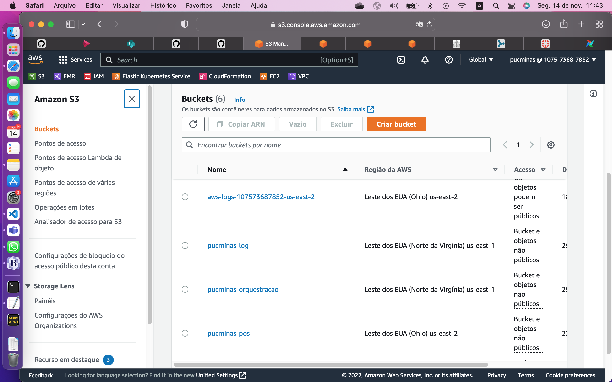

# Trabalho Final - EM DUPLA

> Kelly Frazão Lyra 
> Keylom Emanuel Souza Bebiano

## O que deve ser feito?

1. ✅Criar um Bucket S3
2. ✅Criar um Cluster EMR (criar manualmente e enviar steps depois ou criar na DAG)
3. ✅Criar um cluster Kubernetes
4. ✅Deployar o Airflow no cluster Kubernetes
5. ✅Criar um usuário chamado `airflow-user` com permissão de administrador da conta
6. ✅Escolher um dataset (livre escolha)
7. ✅Subir o dataset em um bucket S3
8. ✅Pensar e implementar construção de indicadores e análises sobre esse dataset (produzir 2 ou mais indicadores no mesmo grão)
9. ✅Escrever no S3 arquivos parquet com as tabelas de indicadores produzidos
10. ✅Escrever outro job spark que lê todos os indicadores construídos, junta tudo em uma única tabela
11. ✅Escrever a tabela final de indicadores no S3
12. ✅Subir um notebook dentro do cluster EMR
13. ✅Ler a tabela final de indicadores e dar um `.show()`
14. ✅Todo o processamento de dados orquestrado pelo AIRFLOW no K8s

# Entregáveis
## ✅1. Link do repositório git (Github, Gitlab) com os códigos

> https://github.com/kellylyra/pos_orq_final_trabalho.git

## ✅2. Print do Bucket S3 criado

## ✅3. Print do Cluster EMR criado 

## ✅4. Print da DAG no Airflow concluída (visão do GRID)

## ✅5. Print do Notebook mostrando a tabela final com `.show()`

**Arquivos criados no S3**

Para envio só serão aceitos arquivos com extensão 'jpg', 'jpeg' ou 'png'.

**DEADLINE - 16 de novembro de 2022**

Dupla:
- Kelly Frazão Lyra 
- Keylom Emanuel Souza Bebiano

Repositório Git
- https://github.com/kellylyra/pos_orq_final_trabalho.git